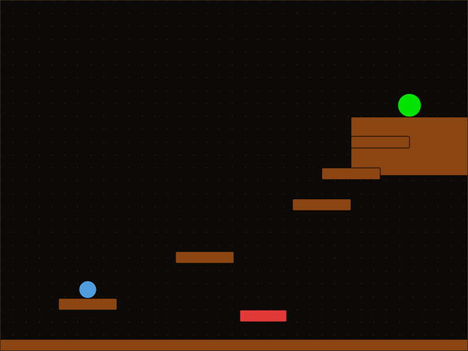
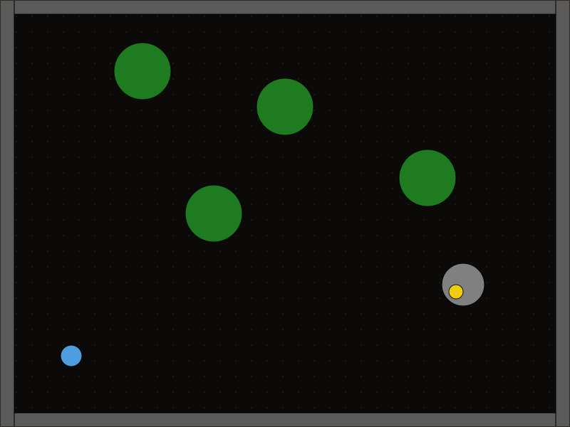
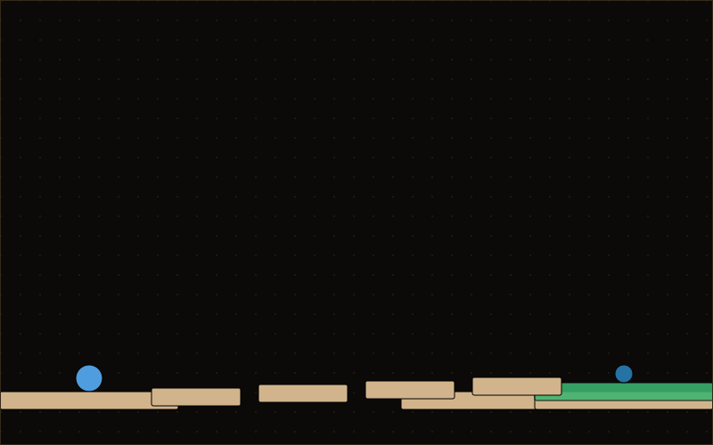
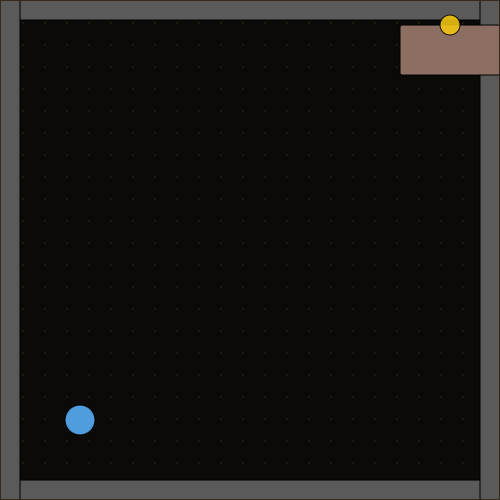
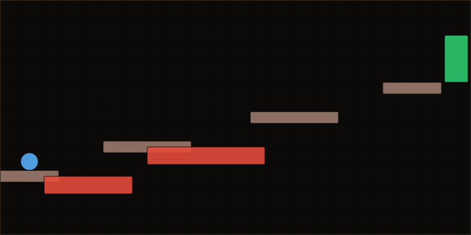
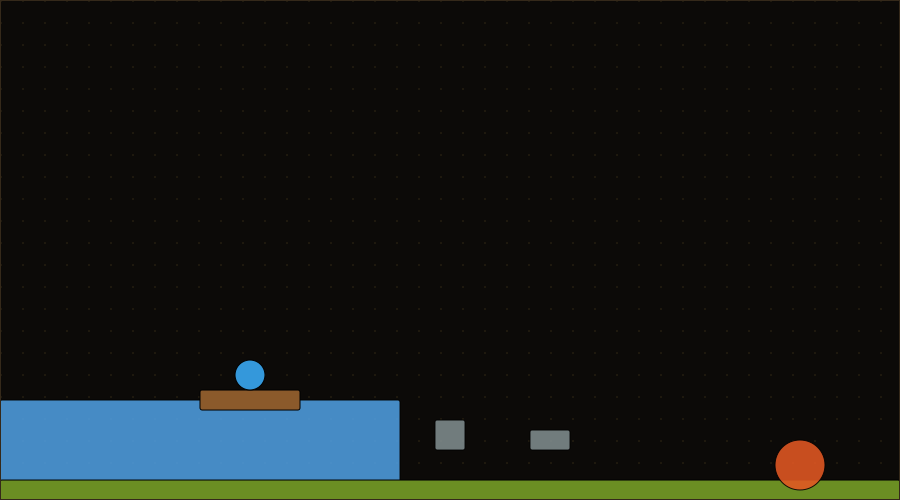
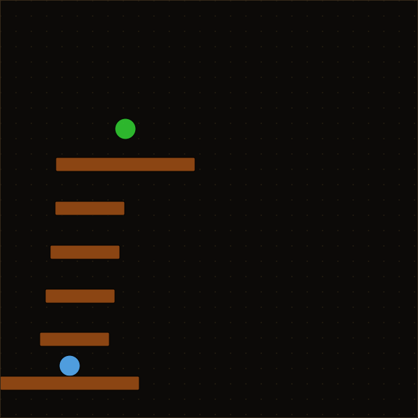
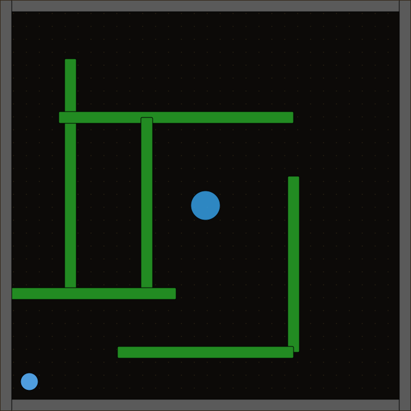
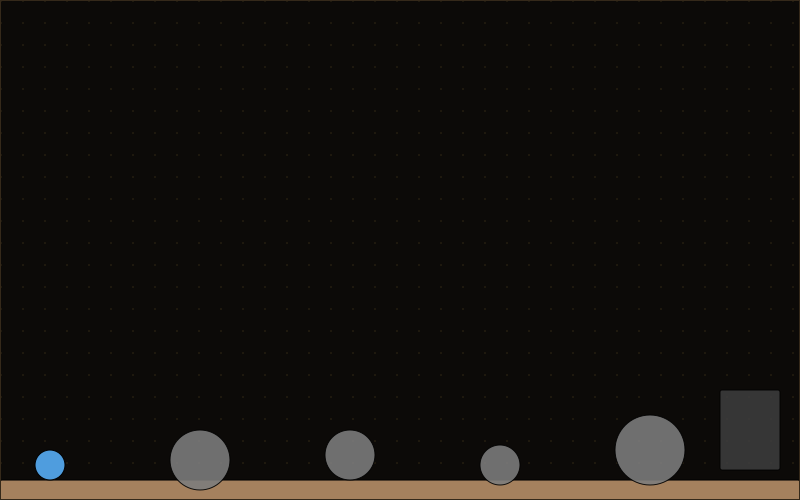
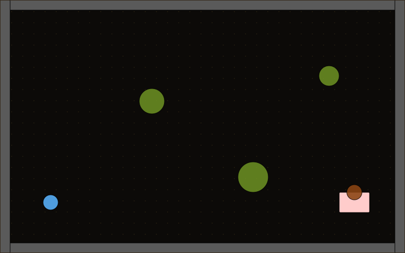

# Gallery

Ten prompts, chosen to span genre, control scheme (platformer vs. topdown), objective type (reach vs. collect), and difficulty — not cherry-picked for a good number, run once end to end via `npm run gallery` (`scripts/gallery.ts`), which just calls the same `generateScene()` and `traverse()` functions the CLI and the UI use. Nothing here is hand-tuned per scene.

**10/10 generated a valid, structurally-winnable scene** — zero generation failures. **4/10 were completed by the agent** inside a deliberately tight 50-decision cap (the in-page "Agent" button allows 60; the CLI allows the scene's full step budget, uncapped). The other 6 are real scenes the agent ran out of budget on — mostly topdown mazes and one long platformer chain — not broken or unwinnable ones.

That split matters: it means the two failure modes this project actually cares about are separated cleanly. Scene *generation* — the core deliverable — is solid. Agent *traversal skill* under an artificially tight budget is a softer, expected source of variance (see "How this number got here" below for what changed to get generation to 10/10).

| Prompt | Controls | Objective | Motif | Result |
|---|---|---|---|---|
| A platformer with three ascending platforms leading to a flag on a cliff, with a spike pit blocking the second jump. | platformer | reach | gauntlet | FAIL — decision-budget-exceeded (50 decisions) |
| A person wandering through a foggy pine forest looking for a lost key near an old well. | topdown | collect | enclosed-maze | FAIL — decision-budget-exceeded (50 decisions) |
| A desert canyon the player must jump across to reach an oasis with a flag. | platformer | reach | branching-paths | **SUCCESS** (17 decisions) |
| A small locked room with a table in the corner and a can sitting on top of it that must be grabbed. | topdown | collect | staircase-ascent | FAIL — decision-budget-exceeded (50 decisions) |
| An obstacle gauntlet with lava pits and a narrow platform path to an exit door. | platformer | reach | enclosed-maze | FAIL — timeout (40 decisions) |
| A tranquil lakeside with a fishing dock, some rocks, and a distant campfire to reach. | platformer | reach | gauntlet | **SUCCESS** (33 decisions) |
| A vertical tower climb with stacked platforms rising toward a flag at the top. | platformer | reach | staircase-ascent | FAIL — timeout (25 decisions), see caveat below |
| A maze of hedges in a garden, with a fountain goal at the center. | topdown | reach | open-expanse | FAIL — decision-budget-exceeded (50 decisions) |
| A rocky mountain pass with boulders scattered around, ending at a cave entrance. | platformer | reach | collect-and-return | **SUCCESS** (23 decisions) |
| An open meadow at sunset with scattered trees and a picnic basket to collect near a blanket. | topdown | collect | open-expanse | **SUCCESS** (20 decisions) |

Each row's generated scene (`scenes/`) and full agent trace (`traces/`) are committed and viewable in `npm run dev` — pick them from the scene dropdown, click **Replay** for the recorded run above, or **Agent** to have it try again live, or **Play** to drive it yourself. Top-down previews (`gallery/*.svg`) below, in prompt order:

## How this number got here

The first run of this exact script (same prompts, before any fixes) scored 4/10 with **3 generation failures** — scenes the model couldn't produce a valid version of after 3 repair attempts, not just hard-to-play ones. Digging into the actual repair-loop transcripts (not just the pass/fail count) surfaced two real bugs, both fixed and re-verified against the exact cases that triggered them:

1. **An objective that could never be satisfied, by construction.** `validateScene.ts` never checked that a `collect`-with-`near` objective (e.g. "grab the key near the well") was geometrically achievable — one generated scene placed the key 42 units from its anchor against a 40-unit tolerance. Since both were static, that distance never changed during play; the objective was mathematically impossible for anyone, agent or human. Now caught and rejected before a scene is ever written.
2. **Repair feedback that described the rule but not the fix.** When a jump target was unreachable, the validator told the model the numeric constraint (≤180 horizontal / ≤90 vertical units between platforms) but not what to actually do about it — repeated testing showed the model responding by nudging the target's position a few pixels per retry instead of adding a platform, and still failing after every attempt. The validator now computes and hands over the exact intermediate-platform coordinates that would bridge the gap, the same pattern that already made spawn-placement repairs converge reliably.

Re-running the *exact* prompt that failed all 4 attempts before fix #2 now converges in 2. Applying both fixes took generation failures from 2-3/10 down to 0/10 across the final run.

**One known, disclosed limitation**: a "vertical tower climb" scene in this run generated validly and is graph-reachable step-by-step, but its actual agent trace shows the player falling out of the world entirely (position diverging to y ≈ -50,000) after a missed jump partway up a long single-file platform chain. `validateScene.ts` checks that each hop is individually within jump range, but doesn't yet check that a *long chain* of technically-valid hops isn't fragile as a whole — one miss anywhere in a 5+ step chain is currently unrecoverable. This is a real, understood gap, not a hidden one; closing it would mean rejecting scenes that need too many sequential hops end-to-end rather than validating each hop in isolation.
